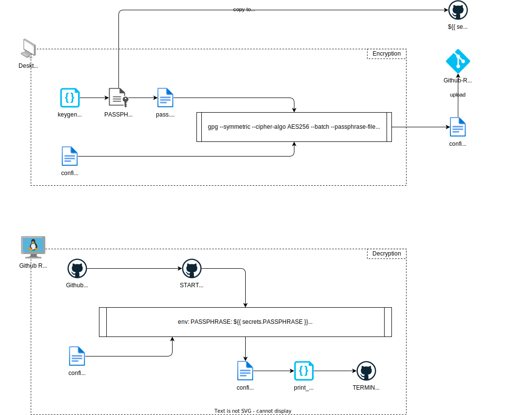

# Secure Data Handling Guide

This guide demonstrates a method for managing sensitive data within a public repository, leveraging GPG (GNU Privacy Guard) and GitHub. Utilizing GPG for encryption and decryption is a straightforward and secure approach.

## Encrypt offline and decrypt in GitHub-Actions



### Encryption Process

In this step, you will encrypt a file named `confidential.json` using the AES256 encryption algorithm. The passphrase required for encryption is stored in a file named `pass.txt`.

```bash
# Encrypt the file using AES256 algorithm
# --symmetric: indicates symmetric encryption
# --cipher-algo AES256: specifies the encryption algorithm to use
# --batch: ensures the command is non-interactive
# --passphrase-file pass.txt: specifies the file containing the passphrase
# confidential.json: the file to be encrypted
gpg --symmetric --cipher-algo AES256 --batch --passphrase-file pass.txt confidential.json
```

### Decryption Process

To decrypt the previously encrypted file, use the following command:

```bash
# Decrypt the file
# --quiet: suppresses output
# --batch: ensures the command is non-interactive
# --yes: assumes "yes" as the answer to any prompts
# --decrypt: indicates decryption
# --passphrase-file pass.txt: specifies the file containing the passphrase
# --output decrypted_file.json: specifies the name of the output file
# confidential.json.gpg: the encrypted file to be decrypted
gpg --quiet --batch --yes --decrypt --passphrase-file pass.txt --output decrypted_file.json confidential.json.gpg
```

## GitHub Setup

### Decryption Process

In a GitHub environment, you can decrypt the file using an environment variable to securely handle the passphrase.

```bash
# Decrypt the file within GitHub
# --quiet, --batch, --yes, --decrypt: as explained above
# --passphrase="$PASSPHRASE": uses an environment variable for the passphrase
# --output $HOME/decrypted_file.json: specifies the output file path
# confidential.json.gpg: the encrypted file to be decrypted
gpg --quiet --batch --yes --decrypt --passphrase="$PASSPHRASE" --output $HOME/decrypted_file.json confidential.json.gpg
```
